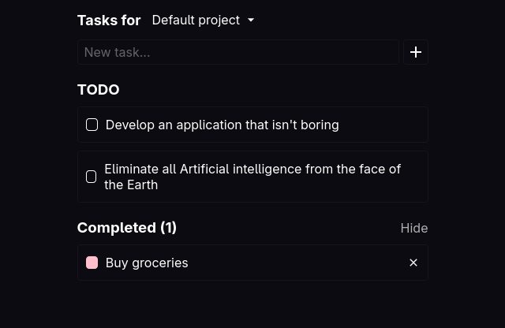

### simplan

A simple web-based planner app (a.k.a. the infamous TODO app). It supports multiple projects/lists of tasks and stores all data in IndexedDB.
This was made in a few hours for practice, and is not intended for real use, of course.

*A sample of the application.*

#### TODO

Things that should (or at least would be nice to) be added:
- [ ] Better error handling.
- [ ] Optional backend for synchronization.